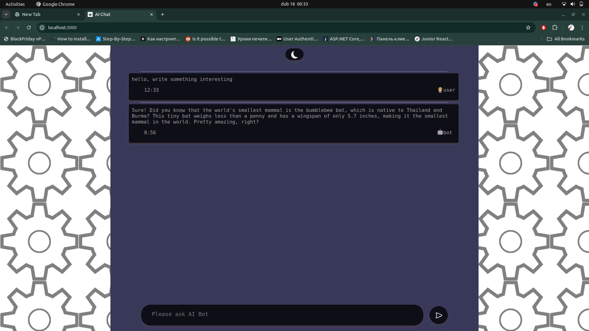
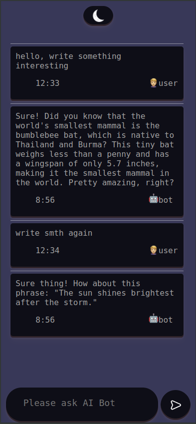
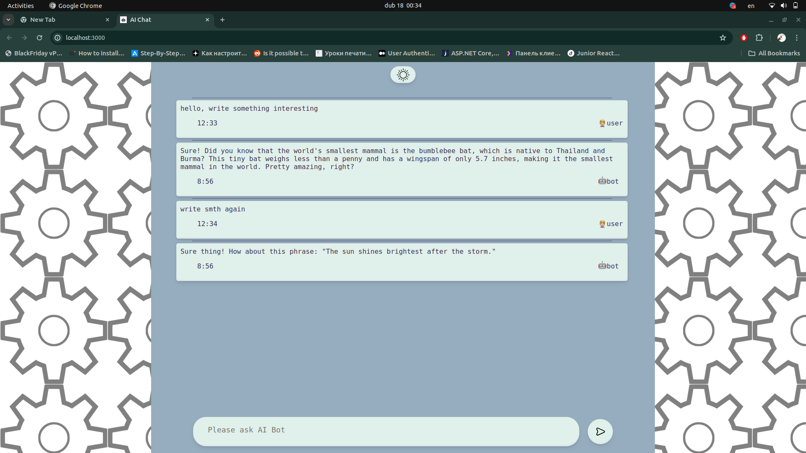
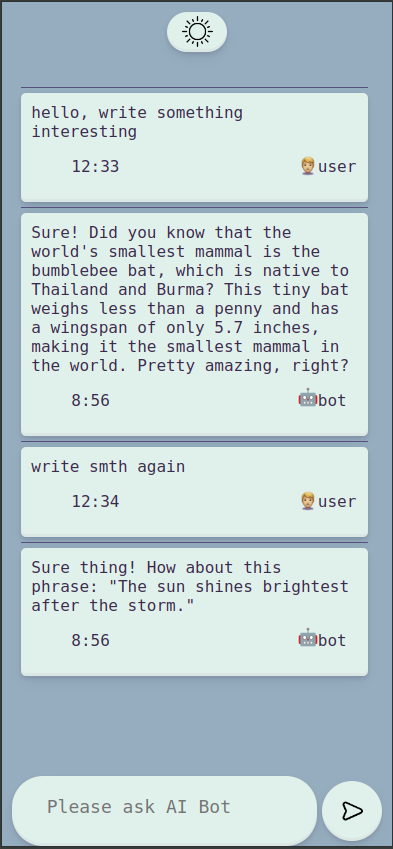

# React Chat Interface with Mock AI Agent

## Overview

This project is a React chat interface that allows users to interact with a mock AI agent. Users can send messages and receive responses from the AI agent, providing a basic conversational experience.

## Screenshots

Dark Theme:

Dark Theme Mobile:

Light Theme:

Light Theme Mobile:

## Core Features

1. **Chat UI Layout:** Implemented a chat interface with a clear layout for user messages and AI responses. The interface includes a chat history display area, a text input field for typing messages, and a send button to submit messages.

2. **Mock AI Responses:** Integrated functionality for the AI agent to respond with predetermined messages following each user input. These responses are displayed in the chat history alongside user messages.

3. **Responsiveness:** Ensured the chat interface is responsive, providing a seamless experience across different devices and screen sizes.

## Optional Features Implemented

1. **Simulate AI "Thinking" Process:** Enhanced the chat interaction by introducing a brief delay to simulate the AI agent "thinking" before displaying its response. During this delay, send button will have waves, which simulates AI thinking.

## Technologies Used

- React.js
- Express.js (for chatbot backend)

## Getting Started

To run this project locally:

1. Clone this repository.
2. Navigate to backend directory (you need to do this, if you want chat to respond): `cd back`.
3. Install dependencies: `npm install`.
4. run backend: `npm run start`.
5. Open a new terminal. If you're using Linux, you can open a new terminal by pressing Ctrl + Alt + T.
6. Navigate to the frontend directory: `cd front`.
7. Install dependencies: `npm install`.
8. Start the development server: `npm start`.

## Additional Information

You can just run frontend side, you'll get all functional, but chat will respond that something went wrong.